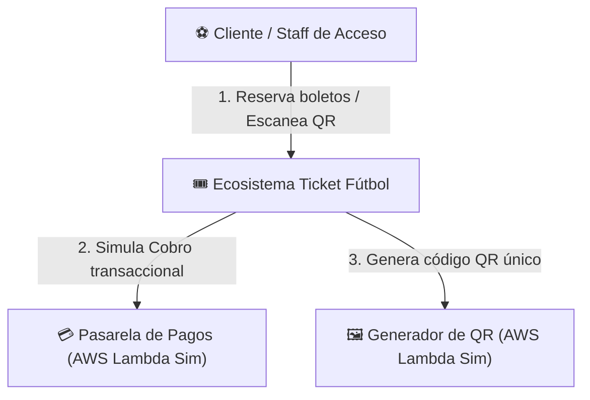
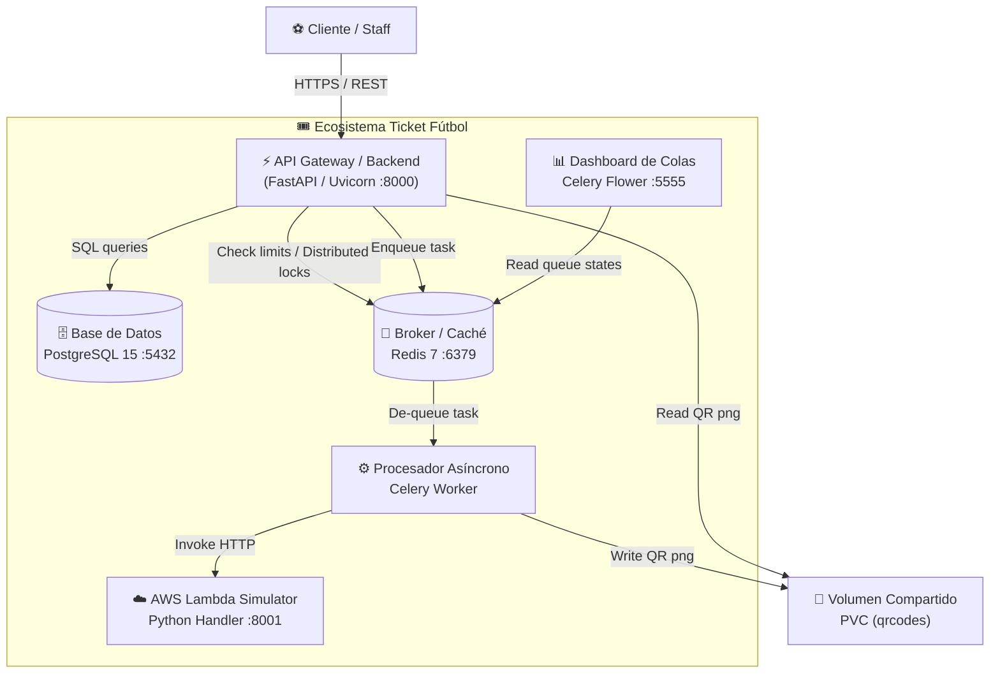
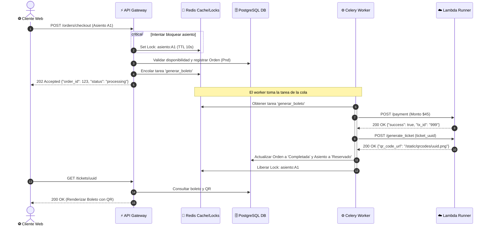
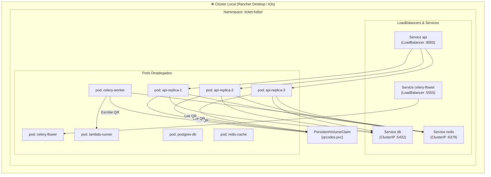

# Diagramas de Arquitectura - Ecosistema Ticket Fútbol

Este documento compila de forma exclusiva todos los diagramas de la arquitectura del proyecto, expresados bajo el estándar de **C4 Model** (Contexto y Contenedores), diagramas de secuencia transaccional y diagramas de infraestructura de Kubernetes.

---

## 1. C4 Model - Nivel 1: Diagrama de Contexto
Muestra a los actores del sistema y los sistemas externos que interactúan con el ecosistema.

---

## 2. C4 Model - Nivel 2: Diagrama de Contenedores
Muestra las aplicaciones de software desacopladas que conforman el ecosistema, sus puertos, bases de datos y flujos de comunicación.

---

## 3. Diagrama de Secuencia Transaccional (Flujo de Compra Asíncrono)
Muestra la secuencia cronológica de una compra de boleto por un usuario, demostrando el desacoplamiento temporal de la cola y la lambda serverless.

---

## 4. Diagrama de Despliegue e Infraestructura (Kubernetes)
Detalla los componentes físicos de hardware y software en Rancher Desktop (Kubernetes local).

