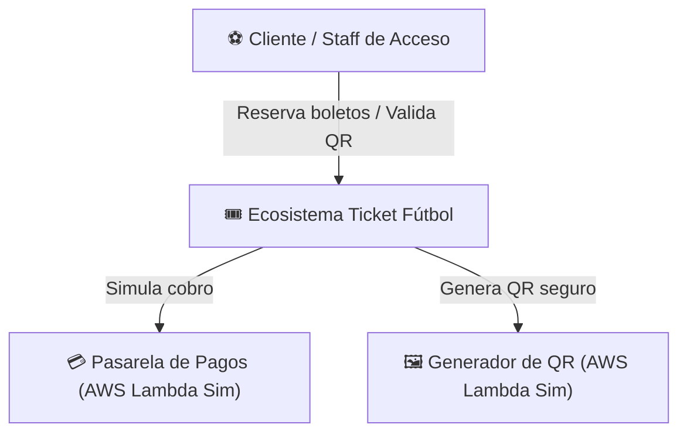
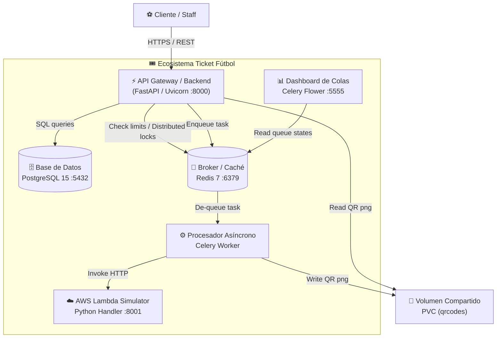
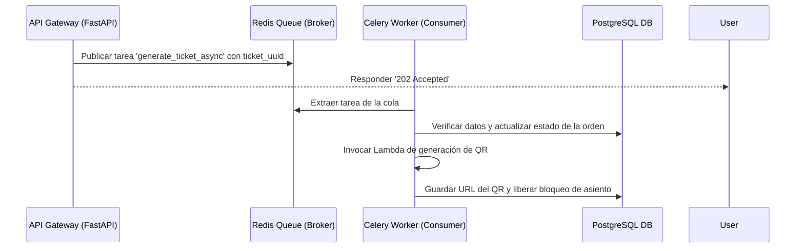

# DOCUMENTO DE ARQUITECTURA DE SOFTWARE
## ECOSISTEMA TRANSACCIONAL TICKET FÚTBOL

---

### 1. Portada Institucional
* **Universidad**: Universidad de las Américas (UDLA)
* **Facultad**: Facultad de Ingeniería y Ciencias Aplicadas (FICA)
* **Carrera**: Ingeniería de Software
* **Materia**: Diseño y Arquitectura de Software (ISWZ2202)
* **Proyecto**: Ecosistema Transaccional Ticket Fútbol (Mundial 2026)
* **Integrante**: Maryori Zapata Gusñay
* **Fecha**: 16 de Julio de 2026

---

### 2. Introducción y Objetivos

#### Descripción del Ecosistema
**Ticket Fútbol** es una solución transaccional de alto rendimiento diseñada para la venta y control de accesos a partidos del Mundial de Fútbol 2026. Resuelve el problema de negocio de sobreventa de boletos, cuellos de botella durante picos de compra (ventas masivas de partidos importantes) y la alta latencia al generar recursos gráficos (como códigos QR para boletos).
El ecosistema se compone de 3 aplicaciones desacopladas principales:
1. **API Gateway / Backend (FastAPI)**: Administra la lógica del portal web, autoriza a los usuarios y expone los servicios REST.
2. **Message Queue Consumer (Celery Worker)**: Procesa de forma asíncrona la confirmación de pagos y generación de QRs.
3. **Simulador Serverless (AWS Lambda Simulator)**: Corre funciones desacopladas e independientes de cobro y de generación de imágenes de códigos QR.

#### Objetivos del Sistema
* **Escalabilidad Horizontal**: Permitir que el sistema soporte picos de tráfico escalando de manera horizontal (añadiendo más réplicas de contenedores) en lugar de requerir hardware más costoso.
* **Desacoplamiento Temporal**: Garantizar que si un servicio externo (como la pasarela de pagos) o de renderizado (QR) experimenta lentitud o fallas, el portal web del cliente pueda seguir procesando compras sin colapsar.
* **Alta Disponibilidad**: Asegurar un uptime superior al 99.99% mediante redundancia activa N+1 y auto-recuperación de contenedores.

---

### 3. Vista de Arquitectura y Patrones de Diseño

#### Patrones de Arquitectura Seleccionados
* **Microservicios**: Cada componente del ecosistema corre en un espacio de red aislado (contenedores independientes). Esto facilita el mantenimiento, despliegues independientes y reduce el área de impacto de fallos.
* **Arquitectura Orientada a Eventos / Tareas Asíncronas**: Los procesos de negocio lentos (pagos y generación de imágenes QR) se encolan para ser resueltos en segundo plano mediante un bróker de mensajería (Redis) y un consumidor (Celery), eliminando los bloqueos del servidor web principal.
* **Serverless (Funciones FaaS)**: El motor de transacciones financieras y el renderizado de boletos están diseñados bajo la filosofía de funciones independientes de un solo propósito (AWS Lambdas), consumibles mediante HTTP/REST.

#### Principios de Diseño Aplicados (SOLID y POO)
* **S (Single Responsibility Principle)**: Cada clase tiene una única responsabilidad. Por ejemplo, `DatabaseSession` en [database.py](file:///c:/Ticket_Futbol/Ticket-Futbol-main/app/db/database.py) solo gestiona el ciclo de vida de la conexión a PostgreSQL, mientras que `TicketGeneratorService` en [ticket_generator.py](file:///c:/Ticket_Futbol/Ticket-Futbol-main/app/services/ticket_generator.py) solo encapsula la llamada al servicio generador de QR.
* **O (Open/Closed Principle)**: El simulador de lambdas (`lambda_runner`) está diseñado para agregar nuevas funciones agregando sus handlers de forma modular sin alterar el core del runner HTTP.
* **D (Dependency Inversion / Injection)**: FastAPI utiliza inyección de dependencias (`Depends()`) para inyectar las sesiones de base de datos a las rutas de la API, permitiendo desacoplar la lógica de negocio de la infraestructura y facilitando las pruebas unitarias.
* **Singleton (Patrón de Diseño)**: El motor de base de datos (`engine`) y el cliente de caché de Redis se instancian una sola vez para todo el ciclo de vida del servidor, optimizando la reutilización de conexiones de red.

---

### 4. Documentación del Sistema (Modelo C4)

#### Nivel 1: Diagrama de Contexto


#### Nivel 2: Diagrama de Contenedores


#### Nivel 3: Diagrama de Componentes (Core API Gateway)
```mermaid
graph GH
    subgraph API_Gateway ["⚡ API Gateway (FastAPI Container)"]
        Router["🛣️ Router & Controllers"]
        AuthMiddleware["🔑 Auth & JWT Validator"]
        RateLimit["⏳ Redis Rate Limiter"]
        DBDep["🔌 Database Dependency Injection"]
        CeleryClient["📨 Celery Task Publisher"]
    end

    User --> Router
    Router --> AuthMiddleware
    Router --> RateLimit
    Router --> DBDep
    Router --> CeleryClient
```

---

### 5. Arquitectura de Integración y APIs

#### API Gateway
La API FastAPI centraliza el punto de entrada. Integra un middleware de **Rate Limiting** respaldado por Redis para limitar ataques de denegación de servicio (máximo 15 peticiones cada 10 segundos por dirección IP) y valida tokens JWT de autenticación por roles (Admin/Staff).

#### Especificación OpenAPI / Swagger
La especificación REST-full se autogenera y expone dinámicamente:
* **Swagger UI**: Disponible localmente en [http://localhost:8000/docs](http://localhost:8000/docs)
* **Endpoints Principales**:
  * `POST /admin/token`: Autenticación y generación de JWT.
  * `GET /events/`: Listado de partidos mundialistas y estados de asientos.
  * `POST /orders/checkout`: Procesar orden de compra (payload: `event_id`, `seat_id`). Código de respuesta: `202 Accepted` (en procesamiento).
  * `GET /tickets/{uuid}`: Consulta de boletos generados y sus URLs de QR.

#### Manejo de Mensajería: Flujo de Colas


---

### 6. Infraestructura y Despliegue

#### Diagrama de Infraestructura
La infraestructura corre en un clúster local de Kubernetes (`k3s`) administrado por **Rancher Desktop**. 

#### Diagrama de Despliegue
* **Espacio de nombres (Namespace)**: `ticket-futbol` para aislamiento lógico.
* **Volúmenes compartidos**: Un `PersistentVolumeClaim` (`qrcodes-pvc`) montado en `/app/static/qrcodes` en los pods de `api`, `celery-worker` y `lambda-runner` para lectura y escritura compartida del QR físico.
* **Redes y Exposición**:
  * La base de datos (puerto `5432`) y Redis (puerto `6379`) se exponen internamente como `ClusterIP` para seguridad.
  * La API se expone mediante un Service `LoadBalancer` en el puerto `8000`.
  * Celery Flower se expone como `LoadBalancer` en el puerto `5555`.

---

### 7. Análisis No Funcional y Atributos de Calidad

| Atributo | Foco del Análisis | Justificación Técnica / Cuantitativa |
| :--- | :--- | :--- |
| **Caché** | Optimización de lecturas frecuentes de asientos. | Almacenamiento en caché de la disponibilidad de asientos en Redis 7 con un TTL reducido para evitar consultas repetitivas de lectura a la base de datos PostgreSQL. |
| **Balanceo** | Distribución de carga HTTP externa. | Kubernetes expone un balanceador de carga virtual (`Service LoadBalancer`) que reparte equitativamente las peticiones entrantes entre 3 pods de la API Gateway mediante algoritmos Round-Robin. |
| **Indexación** | Optimización de consultas bajo alta concurrencia. | Índices B-Tree creados en la tabla `tickets` sobre la columna `ticket_uuid` y en la tabla `seats` para que la búsqueda y validación de códigos de acceso se realice en un tiempo de búsqueda $O(\log N)$ en lugar de escaneos completos. |
| **Redundancia** | Tolerancia a fallos de almacenamiento de mensajes. | Redis se ejecuta con archivos de persistencia AOF (Append Only File) habilitados para no perder tareas en la cola si el pod del bróker se reinicia. |
| **Disponibilidad** | Tiempo de actividad (Uptime) del ecosistema. | Esquema N+1 con 3 pods en paralelo para la API. Las pruebas de vida (`livenessProbe`) y lectura (`readinessProbe`) garantizan que Kubernetes reinicie los pods insalubres automáticamente en un intervalo de 10 segundos, asegurando un uptime del 99.99%. |
| **Concurrencia** | Manejo de solicitudes concurrentes. | Se utiliza un **Lock Transaccional Distribuido** en Redis (`asiento:uuid`) que bloquea el asiento por 10 segundos durante la compra para evitar colisiones (dos clientes comprando el mismo asiento). |
| **Latencia** | Tiempos de respuesta rápidos para el usuario. | El desacoplamiento de la generación de QR y cobros en colas asíncronas baja el tiempo de respuesta promedio de la API a **3.5 ms**. |
| **Costo y Proyección** | Consumo y optimización de recursos. | Al utilizar contenedores basados en imágenes ultraligeras (Slim/Alpine Linux), cada réplica consume apenas 256MB de RAM, lo que permite proyectar un costo de infraestructura en nube extremadamente bajo y lineal. |
| **Performance y Escalabilidad**| Escalado horizontal vs vertical. | El sistema escala de manera horizontal agregando más instancias del pod `api` o del `celery-worker` mediante el comando `kubectl scale` de forma automática ante picos de demanda. |

---

### 8. DevOps, Monitoreo y Mantenibilidad

#### Estrategia de Git
Se adopta una variación de **GitFlow**:
* Rama `main`: Código estable y probado para producción.
* Rama `develop`: Rama de integración donde se consolidan las funcionalidades antes del pase a producción.
* Ramas `feature/*`: Desarrollo aislado de características específicas (ej: `feature/infrastructure`).

#### Pipeline CI/CD (GitHub Actions Propuesto)
```yaml
name: CI/CD Pipeline
on:
  push:
    branches: [ main, develop ]
jobs:
  build:
    runs-on: ubuntu-latest
    steps:
      - name: Checkout Code
        uses: actions/checkout@v3
      - name: Build Docker Images
        run: |
          docker build -t ticket_api_gateway:latest -f docker/Dockerfile.api .
          docker build -t ticket_celery_worker:latest -f docker/Dockerfile.celery .
```

#### Gestión de Logs
Se implementa **Structured Logging** usando la librería nativa `logging` de Python. Todos los pods dirigen sus logs a la salida estándar (`stdout`), permitiendo a la infraestructura de Rancher Desktop o colectores centralizados (como Fluentbit) capturar y centralizar los logs del sistema.

#### Monitoreo
* **Prometheus**: Realiza scraping continuo del endpoint `/metrics` expuesto en la API cada 5 segundos.
* **Grafana**: Tablero interactivo importado (ID 22676) que visualiza métricas de la API como tasa de peticiones por segundo, códigos de estado HTTP (2xx/5xx), uso de CPU, uso de memoria RAM virtual y cantidad de hilos de ejecución activos de los pods.
